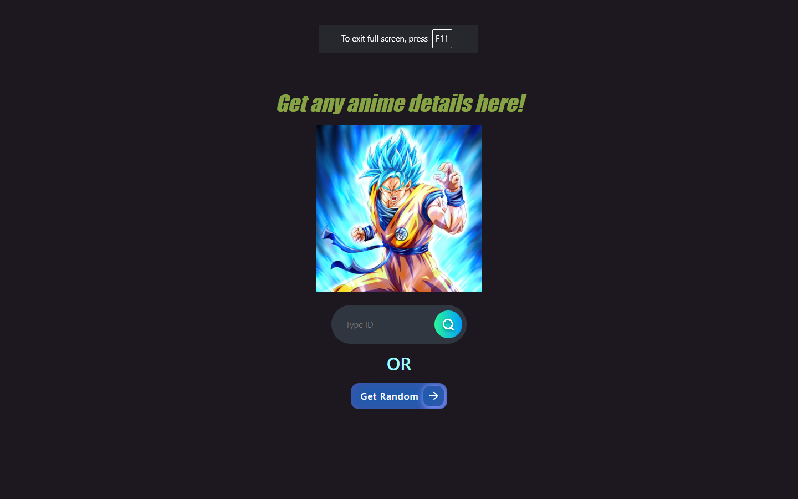
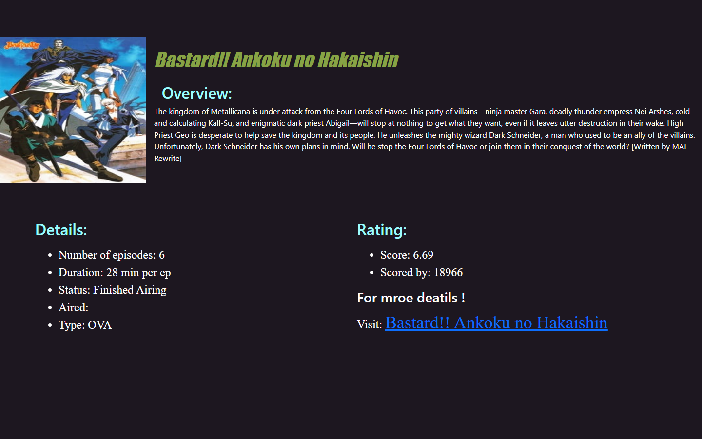

# Anime-Details

Anime-Details is a web application that allows users to get information about any anime by providing a reference ID or by retrieving random anime details from MyAnimeList.net.

## Features
- Retrieve detailed information about anime series, including the number of episodes, synopsis, and more.
- Search for anime by reference ID.
- Get random anime details from MyAnimeList.net.

## Tech Stack

### Backend
- **Node.js**
- **Express.js**
- **Axios**

### Templating Language
- **EJS**

### Frontend
- **HTML**
- **CSS**
- **Bootstrap**

## Screenshots

### Screenshot 1


### Screenshot 2


## Getting Started

### Prerequisites
- Node.js and npm installed on your machine.

### Installation
1. Clone the repository:
   ```sh
   git clone https://github.com/Noumannomi123/Anime-Details
2. run cd Anime-Details
3. run `npm install`
4. run `node index.js`
5. The application will start running on localhost port `3000`.
